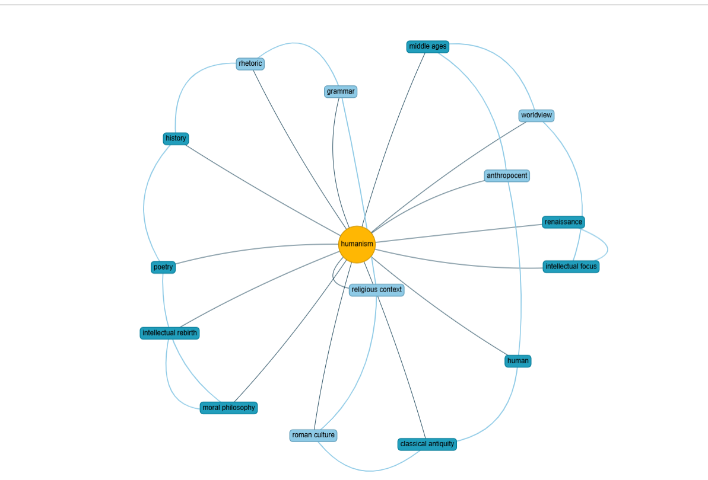

# AI-Based Mindmap Generator v1
  
### An **AI-powered web app** that converts plain text into a **structured, colorful mindmap** of key ideas using **Hugging Face NLP** and **Streamlit**.

  </br>


##  Features  
- 🧠 Extracts key concepts using **Hugging Face NLP models**
- 🎨 Generates clean, centered **mindmaps** like brainstorming diagrams
- 🌈 Interactive visualization via **NetworkX + PyVis**
- 💻 Built entirely with **Python + Streamlit**
<br></br>

## ⚙️ Setup Instructions
### 1️⃣ Clone the Repository
```  
    git clone https://github.com/YOUR-USERNAME/AI-Mindmap.git
    cd AI-Mindmap
```
### 2️⃣ Create Virtual Environment
```      
    python -m venv venv
```
### 3️⃣ Activate it
Windows (PowerShell):
```  
        .\venv\Scripts\Activate.ps1
```
Mac/Linux:
```  
        source venv/bin/activate
```
### 4️⃣ Install Dependencies
```  
        pip install -r requirements.txt
```
### 5️⃣ Add your Hugging Face Token
Create a .env file in the project root and include the following:
```  
    HF_TOKEN=hf_your_generated_token_here
```
### 6️⃣ Run the app
```   
    streamlit run app.py
```
<br></br>
> [!NOTE]
>Ensure that you activate the virtual environment before running the app.

## 🧩 Example  
<br></br>

_The Renaissance, spanning roughly the 14th to the 16th centuries, was an era defined by a dramatic shift in intellectual focus, moving from the God-centered worldview of the Middle Ages to the anthropocentric (human-centered) philosophy of Humanism. This pivotal movement sought to recover, study, and apply the literature, art, and philosophy of classical antiquity, particularly Greek and Roman culture, not merely for religious context but for their inherent value in understanding the human experience. Central to Humanism was the belief in the dignity and potential of the individual, fostering an intense curiosity that fueled advancements in art, science, and governance. Thinkers like Petrarch championed the studia humanitatis (studies of humanity), emphasizing grammar, rhetoric, history, poetry, and moral philosophy—subjects considered essential for cultivating a virtuous and engaged citizenry. This intellectual rebirth laid the foundational groundwork for the Enlightenment and remains a profound example of how rediscovering past wisdom can radically reshape present and future civilization._
  
<br></br>
## 🖼️ Preview
     
  **💻 App Screenshot**
<br></br>




## 🏷️ Version

Version 1.0 (Stable Release)

## 👨‍💻 Author

### Harris Selvaraj J

Built using Python, NLP, Hugging Face, NetworkX, and Streamlit

<br></br>
---


